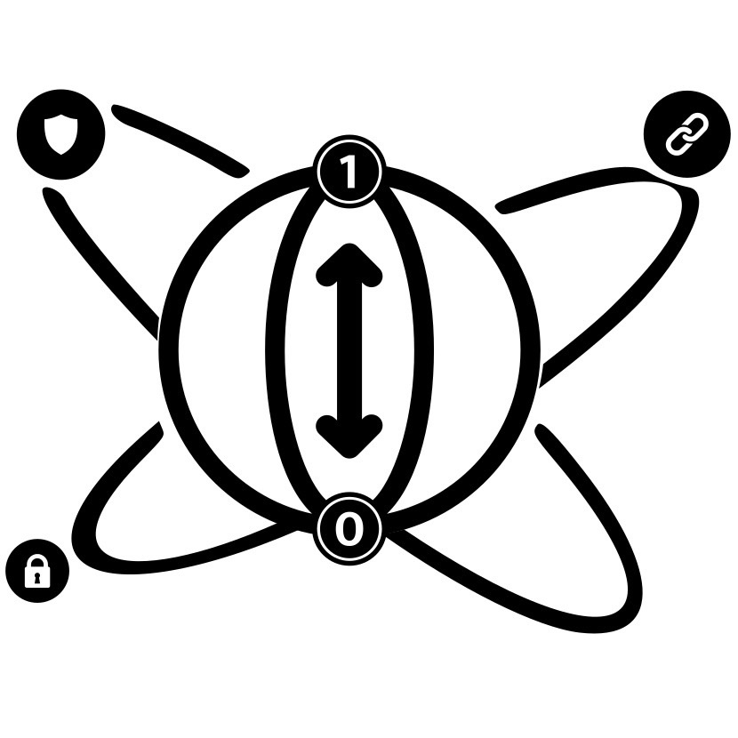

<p align="center">
  
</p>

<h1 align="center">QChain</h1>

<p align="center">
  <b>A post-quantum credential system on Hyperledger Fabric.</b><br/>
  Issue, hold, present and verify digital credentials signed with quantum-resistant cryptography.
</p>

<p align="center">
  
  
  
  
  
  
</p>

---

## 🌐 Live Demo

The system is running on our university VM and exposed publicly via a Tailscale Funnel. Open these
links in any browser — nothing to install:

| App | What it is | Link |
|-----|-----------|------|
| **QPortal** | Issuer / Verifier / IT-Admin web portal | **https://qchain.tail4fff4b.ts.net/** |
| **QWallet** | Credential holder app (web build) | **https://qchain.tail4fff4b.ts.net/wallet/** |

> ⚠️ **It's a live demo, not production.** It runs on a single shared VM, so it may be offline at times,
> the demo database is shared by everyone, and access is open to anyone with the link. The very first
> page load can take a few seconds while the browser downloads the app's rendering engine.

---

## Overview

Today's blockchains sign data with classical cryptography (RSA, ECDSA). A sufficiently powerful quantum
computer running **Shor's algorithm** would break those signatures — and adversaries can already
**"harvest now, decrypt later"**, storing signed records today to forge or repudiate them once quantum
hardware arrives.

**QChain** replaces the classical signature on each credential with **ML-DSA-44 (CRYSTALS-Dilithium)**,
a NIST-standardised, lattice-based post-quantum signature, and anchors it on a permissioned Hyperledger
Fabric ledger. It uses a **hash-on-chain, data-off-chain** model: the full credential JSON lives on
**IPFS** (addressed by its content hash / CID), while only the SHA3-256 hash + PQC signature go on-chain
— keeping the ledger small while remaining tamper-evident.

The system has three faces:

- **QPortal** — a Flutter web app for **Issuers** (universities/authorities), **Verifiers**
  (employers), and **IT Admins** (staff, audit, settings).
- **QWallet** — a Flutter app for credential **Holders** to store credentials and present them via
  QR/OTP with selective disclosure.
- **Off-chain backend** — a Go REST API that ties together Fabric, IPFS, the post-quantum crypto, and a
  MySQL database used for fast lookups, dashboards and history.

---

## Architecture

```
                              Public internet (HTTPS)
                                        │
          https://qchain.tail4fff4b.ts.net   ──  Tailscale Funnel  (443, auto-HTTPS)
                                        │
                                        ▼
                          web-gateway  (Nginx container, :8090)
              /  → QPortal (web)      /wallet/ → QWallet (web)      /api/ → backend
                                        │  (same origin — no CORS, no mixed content)
                                        ▼
                            Go REST API   ·   offchain/   ·   :3000
                ┌────────────────────┬───────────────────┬────────────────────┐
                ▼                    ▼                   ▼                    ▼
        Hyperledger Fabric      IPFS (Kubo)           MySQL            ML-DSA-44 (PQC)
     peers + orderer (etcdraft)  :5001 / :8080        :3306          via liboqs-go (CGo)
     + JavaScript chaincode      credential JSON   lookups/history    sign & verify
     CouchDB state DB            (CID on-chain)
```

- **Authenticity** comes from the ML-DSA-44 signature over the credential hash.
- **Integrity** comes from re-hashing the on-chain credential payload at verify time.
- **Verification is entirely on-chain** — the backend re-hashes the stored Fabric payload and checks the
  signature; it never trusts the database for the cryptographic decision.

---

## Technology stack

| Layer | Technology |
|-------|-----------|
| Blockchain | Hyperledger Fabric 2.x · two orgs (GovernmentMSP, GeneralMSP) + etcdraft orderer · CouchDB state DB |
| Chaincode | JavaScript (Fabric Contract API 2.5) — `qchain-network/chaincode/` |
| Post-quantum crypto | ML-DSA-44 (CRYSTALS-Dilithium, NIST FIPS 204) via **liboqs-go** (C bindings) |
| Off-chain storage | IPFS / Kubo (credential JSON, referenced on-chain by CID) |
| Backend | Go 1.24 REST API (`offchain/`) · `fabric-gateway`, `go-ipfs-api`, `go-sql-driver/mysql` |
| Database | MySQL (`qchain_db`) for holders, credentials, verification logs, subscriptions, alerts, audit |
| Frontend | Flutter 3.35.x (Dart ≥ 3.9.2) — QPortal (web) + QWallet (mobile + web) |
| Public gateway | Nginx reverse proxy (`web-gateway/`) serving both apps + proxying the API on one origin |
| Public access | Tailscale Funnel (permanent `*.ts.net` HTTPS URL, runs as a system service) |

A separate `algo-benchmarking/` module compares **ML-DSA-44/65/87** across two implementations
(liboqs-go C bindings vs. Cloudflare CIRCL pure-Go).

---

## Repository structure

```
QChain-PQC-blockchain/
├── README.md
├── LICENSE                      # Proprietary — all rights reserved
│
├── qchain-network/             # Hyperledger Fabric network
│   ├── chaincode/              # JavaScript chaincode (QChaincode.js, index.js, package.json)
│   ├── config/                 # Fabric config: configtx.yaml, core.yaml, crypto-config.yaml, orderer.yaml
│   ├── docker/                 # docker-compose.yaml (peers/orderer/couchdb/ipfs) + docker-compose-ca.yaml
│   ├── scripts/                # registerEnroll.sh, env-gov.sh, env-gen.sh, schema.sql,
│   │                           # setup-demo.sh, start-demo.sh, setup-ipfs-service.sh,
│   │                           # setup-tailscale-funnel.sh, enrollAdmin.js, registerUser.js
│   ├── channel-artifacts/      # generated channel/genesis blocks   (runtime, gitignored)
│   ├── crypto-material/        # CA-issued MSP certs & keys          (runtime, gitignored)
│   ├── wallet/                 # Fabric gateway identities (.id)     (runtime, gitignored)
│   ├── connection/             # peer connection profiles            (runtime, gitignored)
│   └── fabric-ca/              # Fabric CA server configs
│
├── offchain/                   # Go backend (REST API on :3000)
│   ├── server.go               # entry point: main() + routes + CORS
│   ├── config.go  crypto.go  fabric.go  httputil.go   # config, PQC, Fabric client, helpers
│   ├── credentials.go  verification.go  holders.go    # domain handlers
│   ├── dashboard.go  staff.go  subscriptions.go  mobile.go
│   ├── db.go  db_*.go          # MySQL access, split per domain
│   ├── cmd/keygen/main.go      # generates the ML-DSA-44 org key pair
│   ├── Dockerfile  docker-build.sh  docker-run.sh
│   └── server_test.go
│
├── UI_WebApp/                  # QPortal — Flutter web (issuer / verifier / IT-admin)
├── UI_App/                     # QWallet — Flutter app (holder); builds to mobile + web
│
├── web-gateway/                # One Nginx container: builds both web apps + proxies /api
│   ├── Dockerfile  nginx.conf  docker-build.sh  docker-run.sh  README.md
│
├── algo-benchmarking/          # ML-DSA performance benchmarks (liboqs-go vs CIRCL) + graphs
├── assets/                     # Logo and performance graphs
└── docs/                       # Reports: progress-report-1/2, final-report, literature-review, team-charter
```

---

## Getting started (build it from scratch)

This is the full path for someone cloning the repo onto a fresh machine and standing up the whole
system. It assumes a Linux host (the project runs on an Ubuntu VM). Already on the configured VM?
Skip to [Quick start](#quick-start).

### Prerequisites

| Tool | Version | Used for |
|------|---------|----------|
| Docker + Docker Compose | latest | Running the Fabric network, IPFS, backend, gateway |
| Hyperledger Fabric binaries | 2.x (`peer`, `orderer`, `configtxgen`, `fabric-ca-client`) | Crypto, channel, chaincode lifecycle |
| MySQL | 8.x | The `qchain_db` database |
| IPFS / Kubo | latest | Off-chain credential storage |
| Go | 1.24 | Generating the PQC key pair (the backend itself builds inside Docker) |
| Flutter SDK | 3.35.x (Dart ≥ 3.9.2) | Building the apps outside Docker (optional — the gateway builds them in Docker) |
| Tailscale | latest | Optional — only to expose the apps publicly |

Get the Fabric CLI binaries with the official installer, e.g.:
```bash
curl -sSL https://raw.githubusercontent.com/hyperledger/fabric/main/scripts/install-fabric.sh | bash -s -- binary
export PATH=$PATH:$PWD/bin
```

### 1. Clone

```bash
git clone https://github.com/nihvp/QChain-PQC-blockchain.git
cd QChain-PQC-blockchain
```

### 2. Database

```bash
# create the database + a user, then load the schema (it also seeds demo data)
mysql -u root -p -e "CREATE DATABASE qchain_db CHARACTER SET utf8mb4;"
mysql -u root -p qchain_db < qchain-network/scripts/schema.sql
```

### 3. Hyperledger Fabric network

```bash
cd qchain-network/docker

# 3a. Start the Certificate Authorities
docker compose -f docker-compose-ca.yaml up -d

# 3b. Generate all MSP crypto material via Fabric CA → crypto-material/
cd ../scripts && bash registerEnroll.sh

# 3c. Start the orderer, peers and CouchDB
cd ../docker && docker compose -f docker-compose.yaml up -d \
  orderer0.orderer.example.com peer0.government.uae.com peer0.general.uae.com couchdb0
```

**Channel + chaincode (manual — standard Fabric 2.x lifecycle).** The repo provides the configs
(`config/configtx.yaml`) and the JS chaincode (`chaincode/`) but does **not** script these steps. Use
the peer CLI with the org context helpers, then deploy:

```bash
source qchain-network/scripts/env-gov.sh        # sets CORE_PEER_* for the Government org

# create the channel genesis block from config/configtx.yaml, then create & join 'mychannel'
configtxgen -profile TwoOrgsChannel -channelID mychannel \
  -outputBlock qchain-network/channel-artifacts/mychannel.block
peer channel create -c mychannel -f ... -o orderer0.orderer.example.com:7050 ...
peer channel join  -b qchain-network/channel-artifacts/mychannel.block
source qchain-network/scripts/env-gen.sh        # repeat join for the General org

# deploy the JavaScript chaincode (package → install → approveformyorg on both orgs → commit)
peer lifecycle chaincode package qchaincode.tar.gz \
  --path qchain-network/chaincode --lang node --label qchaincode_1
peer lifecycle chaincode install qchaincode.tar.gz
# ... approveformyorg (each org) ... then:
peer lifecycle chaincode commit -C mychannel -n qchaincode ...
```

### 4. IPFS

```bash
ipfs init                                              # first time only
bash qchain-network/scripts/setup-ipfs-service.sh      # run IPFS as a systemd service (auto-restart)
```

### 5. Backend (off-chain Go API)

```bash
# 5a. Generate the organisation's ML-DSA-44 key pair (prints an env template)
go run ./offchain/cmd/keygen

# 5b. Create offchain/.env with the values below (keys from 5a):
cat > offchain/.env <<'ENV'
ISSUER_PRIVATE_KEY_HEX=<from keygen>
ISSUER_PUBLIC_KEY_HEX=<from keygen>
ISSUER_ORG_ID=GeneralMSP
ISSUER_ORG=general
ISSUER_IDENTITY=issuer1
VERIFIER_ORG=general
VERIFIER_IDENTITY=verifier1
MYSQL_DSN=qchain_user:password@tcp(127.0.0.1:3306)/qchain_db
NETWORK_ROOT=/qchain-network
CHANNEL_NAME=mychannel
CHAINCODE_NAME=qchaincode
IPFS_HOST=127.0.0.1:5001
SERVER_PORT=3000
ENV

# 5c. Build & run (first build ~20 min — it compiles liboqs from source; later builds are cached)
bash offchain/docker-build.sh && bash offchain/docker-run.sh
curl -s http://localhost:3000/health        # → {"status":"ok"}
```

### 6. Seed demo holders

```bash
bash qchain-network/scripts/setup-demo.sh http://localhost:3000
```

### 7. Frontends

**Recommended — the web gateway** builds both apps and serves them on one origin (port 8090):

```bash
export API_BASE_URL="http://localhost:3000"      # or your public Funnel URL + /api
bash web-gateway/docker-build.sh && bash web-gateway/docker-run.sh
# → portal http://localhost:8090/   ·   wallet http://localhost:8090/wallet/
```

The backend URL is **baked in at build time** via `--dart-define=API_BASE_URL=…` (both apps read
`kApiBaseUrl = String.fromEnvironment('API_BASE_URL')`), so rebuild the gateway if that URL changes.

**Or run the apps directly with Flutter** (development):

```bash
cd UI_WebApp && flutter pub get && flutter run -d chrome \
  --dart-define=API_BASE_URL=http://localhost:3000          # QPortal
cd ../UI_App && flutter pub get && flutter run \
  --dart-define=API_BASE_URL=http://localhost:3000          # QWallet (device/emulator)
# Build a QWallet Android APK:  flutter build apk --release --dart-define=API_BASE_URL=...
```

### 8. Public access (optional — your own tunnel)

```bash
# install + connect Tailscale, naming this machine (becomes your URL)
curl -fsSL https://tailscale.com/install.sh | sh
sudo tailscale up --operator=$USER --hostname=qchain
# in the Tailscale admin console: enable HTTPS certificates + Funnel for this node, then:
bash qchain-network/scripts/setup-tailscale-funnel.sh        # maps public 443 → :8090
# share https://<machine>.<tailnet>.ts.net/  and  /wallet/   ·   take offline: tailscale funnel --https=443 off
```

> Because the apps bake in the API URL, build the gateway with `API_BASE_URL=https://<machine>.<tailnet>.ts.net/api`
> (the gateway's `docker-build.sh` can auto-derive this from Tailscale).

### Quick start

If the Fabric network, MySQL, IPFS and `offchain/.env` are already set up on the machine:

```bash
bash qchain-network/scripts/start-demo.sh     # starts IPFS + the backend container, checks the peers
```

---

## API reference

Base URL: `http://localhost:3000` (or `…/api` through the gateway/tunnel). All credential-related
responses include a `credentialID`, and **all timestamps are returned in UAE local time (Asia/Dubai)**.

**Credentials**
| Method | Path | Purpose |
|--------|------|---------|
| POST | `/registerHolder` | Register a credential holder on-chain |
| POST | `/issueCredential` | Issue a PQC-signed credential (on-chain hash + IPFS CID) |
| POST | `/updateCredential` | Update editable credential fields |
| POST | `/revokeCredential` · `/suspendCredential` · `/restoreCredential` | Lifecycle changes |
| POST | `/setCID` | Attach an IPFS CID to a credential |
| GET | `/getAllCredentials` · `/getCredentialsByHolder` · `/getCredentialDetail` | Read credentials |

**Verification**
| Method | Path | Purpose |
|--------|------|---------|
| POST | `/verifyCredential` | On-chain verify (existence, status, signature, hash) |
| GET | `/getVerificationHistory` · `/getVerificationDetail` | Verification logs |

**Holders / Dashboard / Audit**
| Method | Path | Purpose |
|--------|------|---------|
| GET | `/getHolders` | List holders |
| GET | `/getDashboardStats` | Dashboard widgets (counts, recent activity, status alerts) |
| GET | `/getAuditLogs` | Append-only audit log |

**Subscriptions & alerts** (verifier monitoring)
| Method | Path | Purpose |
|--------|------|---------|
| POST | `/requestSubscription` · `/deleteSubscription` · `/unsubscribe` | Manage subscriptions |
| GET | `/getSubscriptions` | List subscriptions |
| GET | `/getSubscriptionAlerts` | Alerts (raised when a monitored credential is suspended/revoked) |
| POST | `/acknowledgeAlert` | Acknowledge an alert |

**Staff & directory** (IT admin)
| Method | Path | Purpose |
|--------|------|---------|
| GET | `/getStaff` · `/getDirectory` | Staff list / org directory |
| POST | `/inviteStaff` · `/updateStaffRole` · `/deleteStaff` | Staff management |

**QWallet (mobile)** — under `/mobile/*`
| Method | Path | Purpose |
|--------|------|---------|
| GET | `/mobile/getCredentialsByHolder` · `/mobile/getActivity` · `/mobile/getCatalog` · `/mobile/getSubscriptions` | Wallet reads |
| POST | `/mobile/toggleFavorite` · `/mobile/fetchDocument` | Wallet actions |
| POST | `/mobile/generateOTP` · `/mobile/generatePresentation` | Create a share session (OTP / QR) |
| POST | `/mobile/approveSubscription` · `/mobile/rejectSubscription` | Respond to verifier requests |
| POST | `/resolveSession` | Verifier redeems a holder's OTP/QR token |
| GET | `/health` | Liveness probe |

---

## Recent updates

- **Full backend integration** — issuance, verification, revocation and lifecycle wired end-to-end
  across Fabric, IPFS, the PQC signer and MySQL.
- **Subscriptions & alerts** — verifiers can monitor a credential; suspending/revoking a subscribed
  credential now raises an alert that surfaces on the dashboard and the verifier's alerts page.
- **`credentialID` in every credential-tied response**, for deep-linking from the frontends.
- **Backend refactor** — the large `server.go`/`db.go` were split into per-domain files for readability.
- **Public access** — a single Nginx `web-gateway` serves both apps + proxies the API on one origin,
  exposed via a permanent Tailscale Funnel URL.
- **UAE-local timestamps** — every time the API returns is now Asia/Dubai local time.

---

## Roadmap

**Phase 1 — Authenticity & integrity (current).** A working post-quantum credential system: ML-DSA-44
signatures with a hash-on-chain / data-off-chain (IPFS) model, full issuance → presentation →
verification → revocation lifecycle, the QPortal and QWallet apps, and a publicly reachable demo.

**Phase 2 — Confidentiality & post-quantum MSP (next).** Integrate post-quantum cryptography into
Hyperledger Fabric's **MSP / identity layer** (replacing the classical ECDSA identities), and add
**confidentiality** — encrypting credential data so the system protects secrecy, not just authenticity
and integrity.

---

## Documentation

In-depth project documents live in [`docs/`](docs/):

- [Progress Report 1](docs/progress-report-1.md) — research & network setup
- [Progress Report 2](docs/progress-report-2.md) — implementation
- [Final Report](docs/final-report.md) — full system, testing & benchmarks
- [Literature Review](docs/literature-review.md) — PQC & quantum-threat background
- [Team Charter](docs/team-charter.md) — roles & governance
- [web-gateway/README.md](web-gateway/README.md) — public-access gateway & tunnel runbook

---

## Team

A University of Sharjah capstone project, supervised by **Dr. Manar Abu Talib** and **Dr. Sohail Abbas**.

| Member | Role |
|--------|------|
| Mohammed Bin Ali Maqqavi ([@M0hd-Maqqavi](https://github.com/M0hd-Maqqavi)) | Project Manager |
| Mohammed Abdul Haris ([@mohammed-ah-14](https://github.com/mohammed-ah-14)) | Technical Lead |
| Mohammed Nihal ([@nihvp](https://github.com/nihvp)) | Quality Assurance Lead |
| Mohammed Obied ([@MohammedObeid88](https://github.com/MohammedObeid88)) | Blockchain Specialist |

---

## License

**Proprietary — all rights reserved.** © 2026 QChain. This source code is proprietary and confidential;
unauthorized copying, modification, distribution, or use is prohibited without prior written permission.
See [LICENSE](LICENSE).

---

## Disclaimer

This is an academic research project, not a production system. The public demo uses seed/demo data on a
shared database. Some properties needed for real deployment — notably secure holder-key handling (private
keys are not yet transmitted/stored with production-grade protection) and confidentiality — are
deliberately out of scope for Phase 1 and are the focus of Phase 2.
